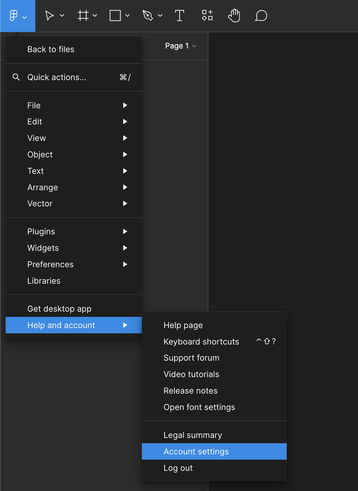
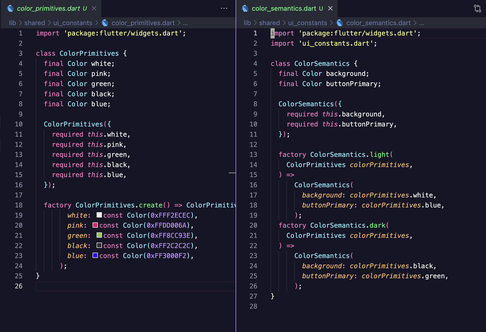

# Figma Variables to Dart

Bring your Figma design system and Flutter app implementation closer together by generating Dart code directly from Figma API.

### Which problem are we trying to solve?
* Figma codegen plugins for Flutter/Drat are limited
* There's manual interaction with Figma UI required and takes time on bigger projects
* No easy way to detect which variables changed/updated without manual inspection


## Installation
```yaml
dev_dependencies:
  figma_vars_to_dart: {latest version} 
  # for now you can use git dependency
```

## Usage

### Create the token

In order to interact with Figma API you will need a personal access token. 
To create your this token you can go to Figma "Help and account" -> "Account settings" -> "Personal Access Tokens" section.




### Run the command

```bash
dart run figma_vars_to_dart \
	 --token $FIGMA_TOKEN \
	 --fileId $1 \
	 --dartOutputFolder lib/shared/design_constants \
	 --jsonOutputFile vars.json 
```


### Use the code



## Example
See `example` folder for more information. 


## Contributing
Contributions are welcome! If you encounter issues, have feature suggestions, or want to improve the package, feel free to open an issue or submit a pull request. Please read our Contribution Guidelines for more information.

## License
This project is licensed under the MIT License.
